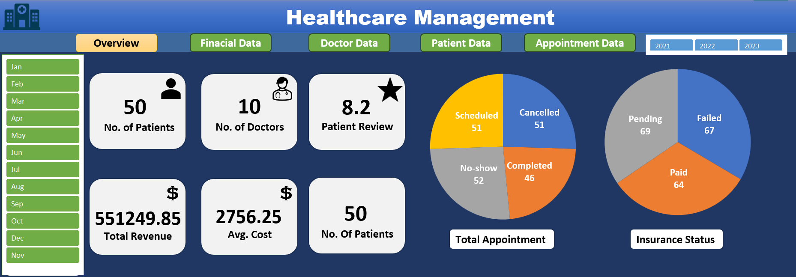
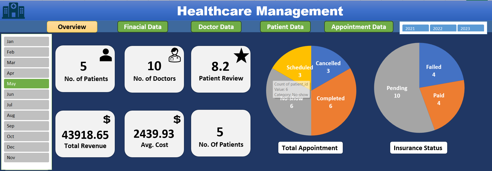
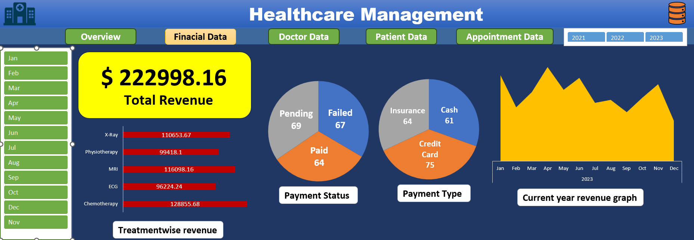
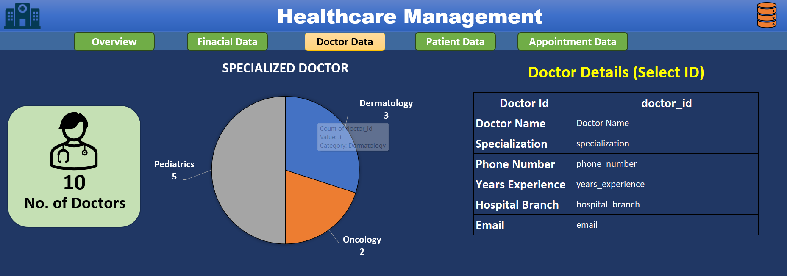
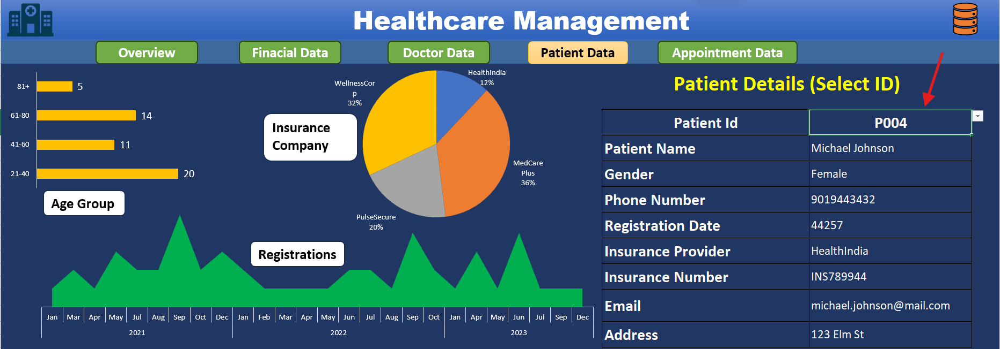
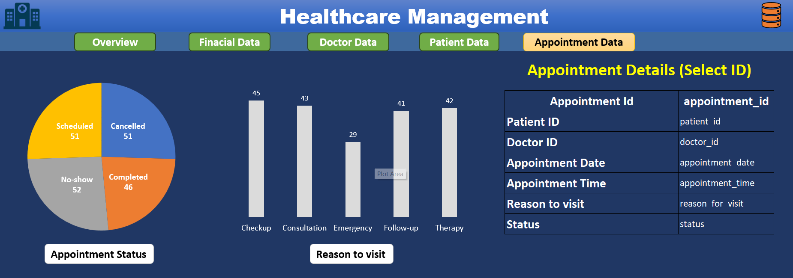

# 🏥 Healthcare Management Excel Dashboard

A comprehensive and interactive **Excel-based Hospital Management Dashboard** designed to analyze, visualize, and monitor key hospital operations such as **Finance**, **Doctors**, **Patients**, and **Treatments**.  

This project uses advanced Excel features including **Pivot Tables**, **Charts**, **Power Query**, **VLOOKUP**, and more to create a dynamic reporting system.

---

## 📌 Project Overview

This dashboard provides insights across five major sections:

- **📊 Overall Dashboard** – High-level KPIs and hospital summary  
- **💰 Finance Dashboard** – Revenue, expenses, treatment cost trends  
- **🧑‍⚕️ Doctor Details** – Doctor details, specialization
- **🧑‍🦽 Patient Details** – Patient demographics, admission patterns  
- **💉 Treatment Details** – Treatment categories, cost analysis

The goal is to make administrative decision-making easier and more data-driven.

---

## 🛠️ Skills & Tools Used

### **Excel Functions**
- VLOOKUP / XLOOKUP  
- INDEX-MATCH  
- SUMIFS, COUNTIFS, IFS  
- Date & text processing formulas  

### **Data Processing**
- **Power Query** for cleaning, merging, and transforming datasets  
- **Data modeling** across multiple tables  

### **Analytics & Visualization**
- Pivot Tables  
- Pivot Charts  
- Slicers & Timelines    
- Conditional Formatting  
- Dynamic charts  

---

## 🏆 Highlights

✔️ Fully automated using **Power Query**  
✔️ Dynamic Dashboards powered by **PivotTables**  
✔️ Interactive filtering using **Slicers**  
✔️ Clean and intuitive UI  
✔️ Scalable and easily updateable  

---

## 🚀 How to Use the Dashboard

1. Open the file **Healthcare Management.xlsx**  
2. Navigate to: **Data → Refresh All** to update Power Query  
3. Use the slicers to filter by:
   - Year
   - Month
4. Explore dashboards from the bottom sheet tabs  or clicking buttons

---

